# Camunda Architecture Analysis

## Table of Contents
1. [Executive Summary](#executive-summary)
2. [Camunda Platform Overview](#camunda-platform-overview)
3. [Core Components Architecture](#core-components-architecture)
4. [Evolution to Unified Architecture (8.8+)](#evolution-to-unified-architecture-88)
5. [Data Flow and Integration Patterns](#data-flow-and-integration-patterns)
6. [API Architecture](#api-architecture)
7. [Deployment Architectures](#deployment-architectures)
8. [Odoo Module Implementation Considerations](#odoo-module-implementation-considerations)
9. [Integration Strategy](#integration-strategy)
10. [Recommendations](#recommendations)

---

## Executive Summary

Camunda is a process orchestration platform that enables organizations to design, execute, and monitor complex business processes. As of 2025, Camunda has undergone significant architectural improvements with version 8.8, consolidating core components into a unified orchestration cluster while maintaining composability and scalability.

**Key Architectural Highlights:**
- **Unified Orchestration Cluster** (Zeebe, Operate, Tasklist, Identity merged)
- **Single REST API** replacing multiple component APIs
- **Cloud-native workflow engine** based on Raft consensus
- **BPMN 2.0 and DMN compliant**
- **Composable architecture** for flexible integration
- **Support for agentic orchestration** with AI agents

---

## Camunda Platform Overview

### High-Level Architecture

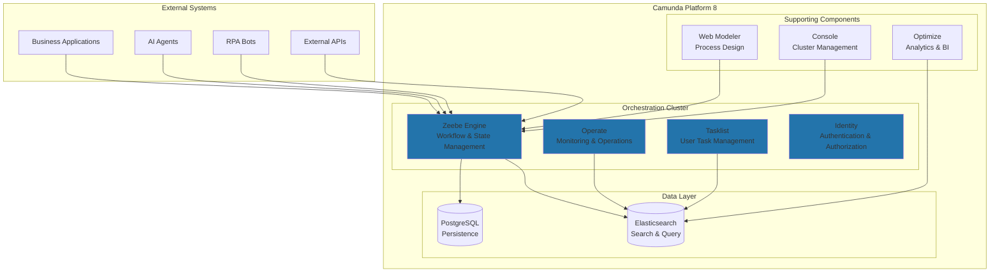
```mermaid
graph TB
    subgraph "Camunda Platform 8"
        subgraph "Orchestration Cluster"
            Zeebe[Zeebe Engine<br/>Workflow & State Management]
            Operate[Operate<br/>Monitoring & Operations]
            Tasklist[Tasklist<br/>User Task Management]
            Identity[Identity<br/>Authentication & Authorization]
        end
        
        subgraph "Supporting Components"
            Optimize[Optimize<br/>Analytics & BI]
            WebModeler[Web Modeler<br/>Process Design]
            Console[Console<br/>Cluster Management]
        end
        
        subgraph "Data Layer"
            Postgres[(PostgreSQL<br/>Persistence)]
            Elasticsearch[(Elasticsearch<br/>Search & Query)]
        end
    end
    
    subgraph "External Systems"
        Apps[Business Applications]
        AI[AI Agents]
        RPA[RPA Bots]
        APIs[External APIs]
    end
    
    Zeebe --> Postgres
    Zeebe --> Elasticsearch
    Operate --> Elasticsearch
    Tasklist --> Elasticsearch
    Optimize --> Elasticsearch
    
    Apps --> Zeebe
    AI --> Zeebe
    RPA --> Zeebe
    APIs --> Zeebe
    
    WebModeler --> Zeebe
    Console --> Zeebe
    
    style Zeebe fill:#2374ab
    style Operate fill:#2374ab
    style Tasklist fill:#2374ab
    style Identity fill:#2374ab
```

### Component Responsibilities

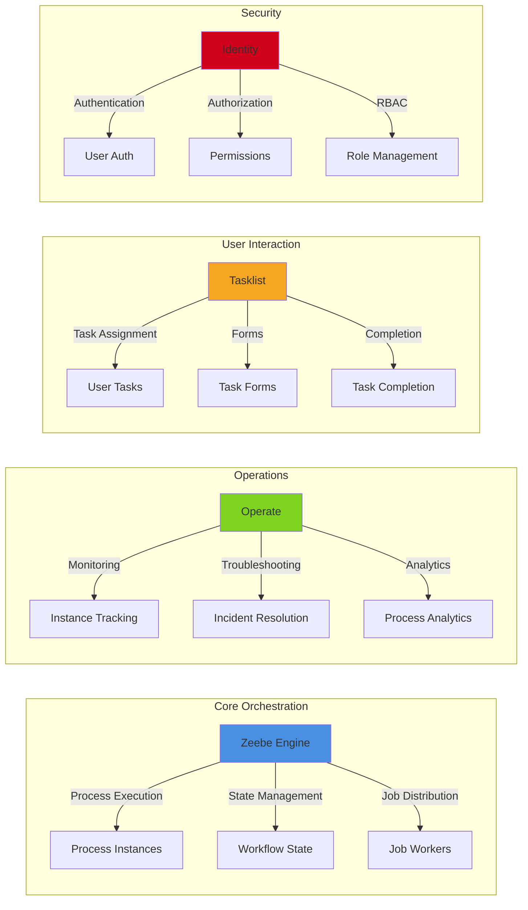
```mermaid
graph LR
    subgraph "Core Orchestration"
        Z[Zeebe Engine]
        Z --> |Process Execution| PE[Process Instances]
        Z --> |State Management| SM[Workflow State]
        Z --> |Job Distribution| JD[Job Workers]
    end
    
    subgraph "Operations"
        O[Operate]
        O --> |Monitoring| MON[Instance Tracking]
        O --> |Troubleshooting| TSHOOT[Incident Resolution]
        O --> |Analytics| ANA[Process Analytics]
    end
    
    subgraph "User Interaction"
        T[Tasklist]
        T --> |Task Assignment| TA[User Tasks]
        T --> |Forms| FORMS[Task Forms]
        T --> |Completion| TC[Task Completion]
    end
    
    subgraph "Security"
        I[Identity]
        I --> |Authentication| AUTH[User Auth]
        I --> |Authorization| AUTHZ[Permissions]
        I --> |RBAC| ROLES[Role Management]
    end
    
    style Z fill:#4a90e2
    style O fill:#7ed321
    style T fill:#f5a623
    style I fill:#d0021b
```

---

## Core Components Architecture

### Zeebe Workflow Engine

Zeebe is the heart of Camunda, designed as a horizontally scalable, distributed workflow engine.

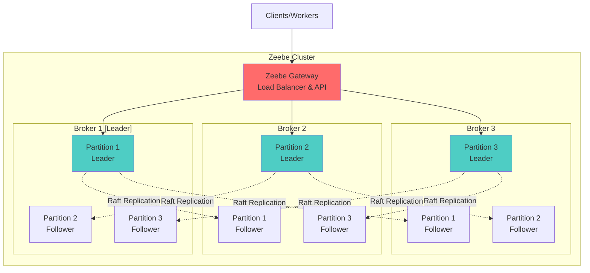
```mermaid
graph TB
    subgraph "Zeebe Cluster"
        subgraph "Broker 1 [Leader]"
            P1[Partition 1<br/>Leader]
            P2F1[Partition 2<br/>Follower]
            P3F1[Partition 3<br/>Follower]
        end
        
        subgraph "Broker 2"
            P1F2[Partition 1<br/>Follower]
            P2[Partition 2<br/>Leader]
            P3F2[Partition 3<br/>Follower]
        end
        
        subgraph "Broker 3"
            P1F3[Partition 1<br/>Follower]
            P2F3[Partition 2<br/>Follower]
            P3[Partition 3<br/>Leader]
        end
        
        Gateway[Zeebe Gateway<br/>Load Balancer & API]
    end
    
    Clients[Clients/Workers] --> Gateway
    Gateway --> P1
    Gateway --> P2
    Gateway --> P3
    
    P1 -.Raft Replication.-> P1F2
    P1 -.Raft Replication.-> P1F3
    P2 -.Raft Replication.-> P2F1
    P2 -.Raft Replication.-> P2F3
    P3 -.Raft Replication.-> P3F1
    P3 -.Raft Replication.-> P3F2
    
    style Gateway fill:#ff6b6b
    style P1 fill:#4ecdc4
    style P2 fill:#4ecdc4
    style P3 fill:#4ecdc4
```

**Key Features:**
- **Raft Consensus Protocol**: Ensures data consistency across brokers
- **Partitioning**: Horizontal scalability through data distribution
- **Replication Factor**: Configurable redundancy (typically 3)
- **Event Sourcing**: All state changes stored as immutable events
- **Backpressure Handling**: Prevents overload through job activation control

### Component Interaction Flow

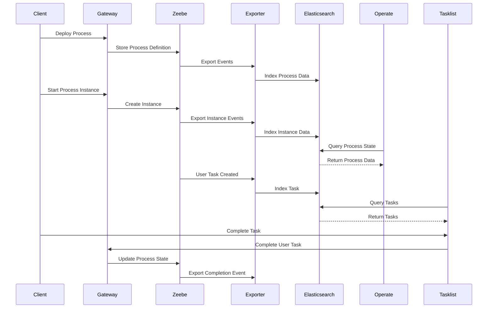
```mermaid
sequenceDiagram
    participant Client
    participant Gateway
    participant Zeebe
    participant Exporter
    participant Elasticsearch
    participant Operate
    participant Tasklist
    
    Client->>Gateway: Deploy Process
    Gateway->>Zeebe: Store Process Definition
    Zeebe->>Exporter: Export Events
    Exporter->>Elasticsearch: Index Process Data
    
    Client->>Gateway: Start Process Instance
    Gateway->>Zeebe: Create Instance
    Zeebe->>Exporter: Export Instance Events
    Exporter->>Elasticsearch: Index Instance Data
    
    Operate->>Elasticsearch: Query Process State
    Elasticsearch-->>Operate: Return Process Data
    
    Zeebe->>Exporter: User Task Created
    Exporter->>Elasticsearch: Index Task
    Tasklist->>Elasticsearch: Query Tasks
    Elasticsearch-->>Tasklist: Return Tasks
    
    Client->>Tasklist: Complete Task
    Tasklist->>Gateway: Complete User Task
    Gateway->>Zeebe: Update Process State
    Zeebe->>Exporter: Export Completion Event
```

---

## Evolution to Unified Architecture (8.8+)

### Legacy Architecture (Pre-8.8)

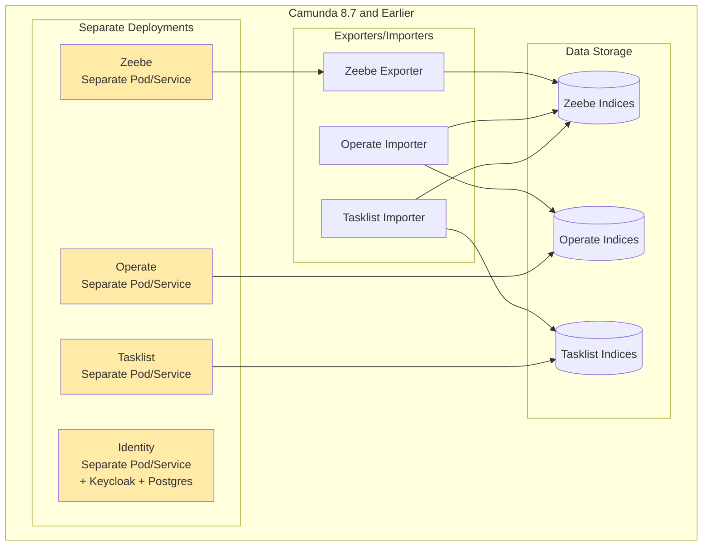
```mermaid
graph TB
    subgraph "Camunda 8.7 and Earlier"
        subgraph "Separate Deployments"
            ZeebeSep[Zeebe<br/>Separate Pod/Service]
            OperateSep[Operate<br/>Separate Pod/Service]
            TasklistSep[Tasklist<br/>Separate Pod/Service]
            IdentitySep[Identity<br/>Separate Pod/Service<br/>+ Keycloak + Postgres]
        end
        
        subgraph "Exporters/Importers"
            ZeebeExp[Zeebe Exporter]
            OpImp[Operate Importer]
            TlImp[Tasklist Importer]
        end
        
        subgraph "Data Storage"
            ZeebeIdx[(Zeebe Indices)]
            OpIdx[(Operate Indices)]
            TlIdx[(Tasklist Indices)]
        end
    end
    
    ZeebeSep --> ZeebeExp
    ZeebeExp --> ZeebeIdx
    
    OpImp --> ZeebeIdx
    OpImp --> OpIdx
    OperateSep --> OpIdx
    
    TlImp --> ZeebeIdx
    TlImp --> TlIdx
    TasklistSep --> TlIdx
    
    style ZeebeSep fill:#ffeaa7
    style OperateSep fill:#ffeaa7
    style TasklistSep fill:#ffeaa7
    style IdentitySep fill:#ffeaa7
```

**Challenges:**
- Complex deployment with multiple independent services
- Data duplication across indices
- Delayed data synchronization (5 seconds to minutes)
- Separate configuration for each component
- External dependency on Keycloak and PostgreSQL for Identity

### New Unified Architecture (8.8+)

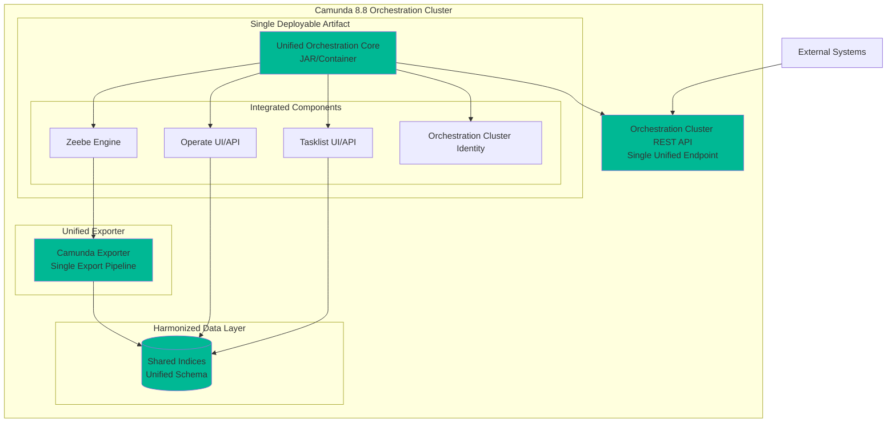
```mermaid
graph TB
    subgraph "Camunda 8.8 Orchestration Cluster"
        subgraph "Single Deployable Artifact"
            Unified[Unified Orchestration Core<br/>JAR/Container]
            
            subgraph "Integrated Components"
                ZeebeInt[Zeebe Engine]
                OperateInt[Operate UI/API]
                TasklistInt[Tasklist UI/API]
                IdentityInt[Orchestration Cluster Identity]
            end
            
            Unified --> ZeebeInt
            Unified --> OperateInt
            Unified --> TasklistInt
            Unified --> IdentityInt
        end
        
        subgraph "Unified Exporter"
            CamundaExp[Camunda Exporter<br/>Single Export Pipeline]
        end
        
        subgraph "Harmonized Data Layer"
            SharedIdx[(Shared Indices<br/>Unified Schema)]
        end
        
        RestAPI[Orchestration Cluster REST API<br/>Single Unified Endpoint]
    end
    
    ZeebeInt --> CamundaExp
    CamundaExp --> SharedIdx
    OperateInt --> SharedIdx
    TasklistInt --> SharedIdx
    
    Unified --> RestAPI
    External[External Systems] --> RestAPI
    
    style Unified fill:#00b894
    style CamundaExp fill:#00b894
    style SharedIdx fill:#00b894
    style RestAPI fill:#00b894
```

**Benefits:**
- **Simplified Deployment**: Single container/JAR for core components
- **Reduced Resource Usage**: Eliminated data duplication
- **Better Performance**: Direct data access, no import lag
- **Unified Configuration**: Single config for all components
- **Built-in Identity**: No external Keycloak dependency
- **Easier High Availability**: Simplified HA setup with unified StatefulSet

---

## Data Flow and Integration Patterns

### Process Execution Flow

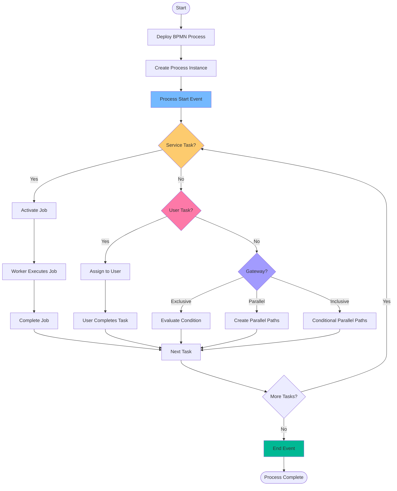
```mermaid
flowchart TD
    Start([Start]) --> Deploy[Deploy BPMN Process]
    Deploy --> CreateInst[Create Process Instance]
    CreateInst --> StartEvent[Process Start Event]
    
    StartEvent --> ServiceTask{Service Task?}
    ServiceTask -->|Yes| JobWorker[Activate Job]
    JobWorker --> ExecuteJob[Worker Executes Job]
    ExecuteJob --> CompleteJob[Complete Job]
    CompleteJob --> NextTask
    
    ServiceTask -->|No| UserTask{User Task?}
    UserTask -->|Yes| AssignTask[Assign to User]
    AssignTask --> UserComplete[User Completes Task]
    UserComplete --> NextTask
    
    UserTask -->|No| Gateway{Gateway?}
    Gateway -->|Exclusive| EvalCondition[Evaluate Condition]
    Gateway -->|Parallel| ParallelSplit[Create Parallel Paths]
    Gateway -->|Inclusive| InclusiveSplit[Conditional Parallel Paths]
    
    EvalCondition --> NextTask
    ParallelSplit --> NextTask
    InclusiveSplit --> NextTask
    
    NextTask[Next Task] --> MoreTasks{More Tasks?}
    MoreTasks -->|Yes| ServiceTask
    MoreTasks -->|No| EndEvent[End Event]
    EndEvent --> Complete([Process Complete])
    
    style StartEvent fill:#74b9ff
    style ServiceTask fill:#fdcb6e
    style UserTask fill:#fd79a8
    style Gateway fill:#a29bfe
    style EndEvent fill:#00b894
```

### External Integration Patterns

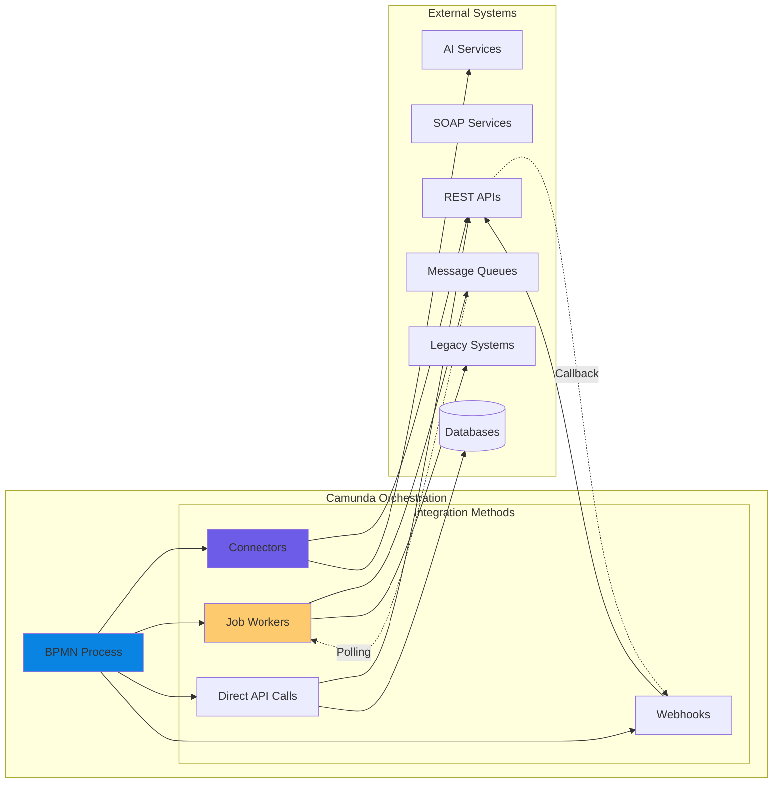
```mermaid
graph LR
    subgraph "Camunda Orchestration"
        Process[BPMN Process]
        
        subgraph "Integration Methods"
            Connector[Connectors]
            JobWorker[Job Workers]
            DirectAPI[Direct API Calls]
            Webhook[Webhooks]
        end
    end
    
    subgraph "External Systems"
        REST[REST APIs]
        SOAP[SOAP Services]
        Queue[Message Queues]
        DB[(Databases)]
        AI[AI Services]
        Legacy[Legacy Systems]
    end
    
    Process --> Connector
    Process --> JobWorker
    Process --> DirectAPI
    Process --> Webhook
    
    Connector --> REST
    Connector --> AI
    JobWorker --> Queue
    JobWorker --> Legacy
    DirectAPI --> REST
    DirectAPI --> DB
    Webhook --> REST
    
    REST -.Callback.-> Webhook
    Queue -.Polling.-> JobWorker
    
    style Process fill:#0984e3
    style Connector fill:#6c5ce7
    style JobWorker fill:#fdcb6e
```

---

## API Architecture

### Unified REST API Structure

```mermaid
graph TB
    subgraph "Orchestration Cluster REST API"
        subgraph "Process Management"
            Deploy[POST /deployments]
            CreateInst[POST /process-instances]
            CancelInst[DELETE /process-instances/{key}]
            GetInst[GET /process-instances/{key}]
        end
        
        subgraph "User Task Management"
            ListTasks[GET /user-tasks]
            AssignTask[POST /user-tasks/{key}/assignment]
            CompleteTask[POST /user-tasks/{key}/completion]
            UpdateTask[PATCH /user-tasks/{key}]
        end
        
        subgraph "Decision Management"
            EvalDecision[POST /decision-definitions/{key}/evaluation]
            GetDecision[GET /decision-definitions]
        end
        
        subgraph "Job Management"
            ActivateJobs[POST /jobs/activation]
            CompleteJob[POST /jobs/{key}/completion]
            FailJob[POST /jobs/{key}/failure]
        end
        
        subgraph "Query & Monitoring"
            SearchInst[POST /process-instances/search]
            SearchTasks[POST /user-tasks/search]
            GetMetrics[GET /metrics]
        end
        
        subgraph "Identity & Security"
            CreateUser[POST /users]
            ManageRoles[POST /roles]
            Permissions[POST /authorizations]
        end
    end
    
    Auth[Authentication Layer<br/>OAuth2/OIDC]
    
    Auth --> ProcessManagement
    Auth --> UserTaskManagement
    Auth --> DecisionManagement
    Auth --> JobManagement
    Auth --> QueryMonitoring
    Auth --> IdentitySecurity
    
    style Auth fill:#e74c3c
```

### API Evolution Comparison

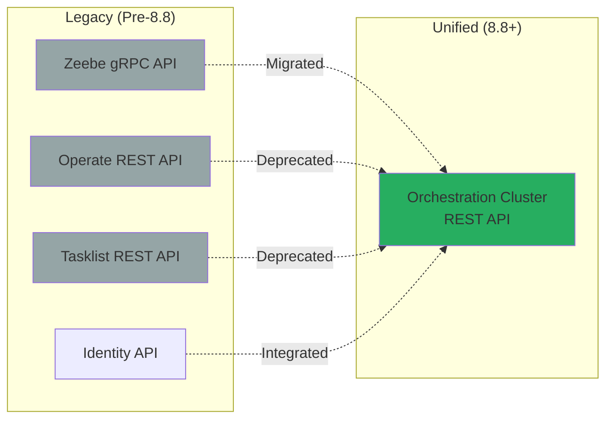
```mermaid
graph LR
    subgraph "Legacy (Pre-8.8)"
        ZeebeAPI[Zeebe gRPC API]
        OperateAPI[Operate REST API]
        TasklistAPI[Tasklist REST API]
        IdentityAPI[Identity API]
    end
    
    subgraph "Unified (8.8+)"
        UnifiedAPI[Orchestration Cluster<br/>REST API]
    end
    
    ZeebeAPI -.Migrated.-> UnifiedAPI
    OperateAPI -.Deprecated.-> UnifiedAPI
    TasklistAPI -.Deprecated.-> UnifiedAPI
    IdentityAPI -.Integrated.-> UnifiedAPI
    
    style UnifiedAPI fill:#27ae60
    style ZeebeAPI fill:#95a5a6
    style OperateAPI fill:#95a5a6
    style TasklistAPI fill:#95a5a6
```

---

## Deployment Architectures

### Kubernetes Deployment

```mermaid
graph TB
    subgraph "Kubernetes Cluster"
        subgraph "Ingress"
            Ingress[Ingress Controller<br/>Load Balancer]
        end
        
        subgraph "Orchestration Cluster StatefulSet"
            OC1[Orchestration<br/>Cluster Pod 1]
            OC2[Orchestration<br/>Cluster Pod 2]
            OC3[Orchestration<br/>Cluster Pod 3]
        end
        
        subgraph "Supporting Deployments"
            WebMod[Web Modeler<br/>Deployment]
            Console[Console<br/>Deployment]
            Optimize[Optimize<br/>Deployment]
        end
        
        subgraph "Data Layer"
            PostgresPVC[(PostgreSQL<br/>PersistentVolume)]
            ElasticPVC[(Elasticsearch<br/>PersistentVolume)]
        end
        
        subgraph "Identity Management"
            MgmtIdentity[Management Identity<br/>For Web Modeler/Console]
        end
    end
    
    Ingress --> OC1
    Ingress --> OC2
    Ingress --> OC3
    Ingress --> WebMod
    Ingress --> Console
    
    OC1 --> PostgresPVC
    OC2 --> PostgresPVC
    OC3 --> PostgresPVC
    
    OC1 --> ElasticPVC
    OC2 --> ElasticPVC
    OC3 --> ElasticPVC
    
    Optimize --> ElasticPVC
    
    WebMod --> MgmtIdentity
    Console --> MgmtIdentity
    
    style OC1 fill:#3498db
    style OC2 fill:#3498db
    style OC3 fill:#3498db
```

### High Availability Architecture

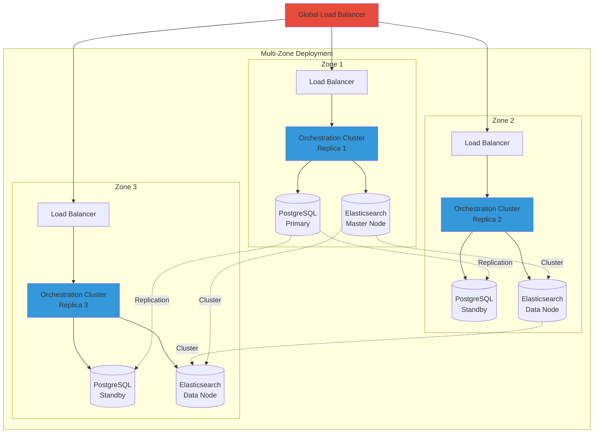
```mermaid
graph TB
    subgraph "Multi-Zone Deployment"
        subgraph "Zone 1"
            LB1[Load Balancer]
            OC1[Orchestration Cluster<br/>Replica 1]
            PG1[(PostgreSQL<br/>Primary)]
            ES1[(Elasticsearch<br/>Master Node)]
        end
        
        subgraph "Zone 2"
            LB2[Load Balancer]
            OC2[Orchestration Cluster<br/>Replica 2]
            PG2[(PostgreSQL<br/>Standby)]
            ES2[(Elasticsearch<br/>Data Node)]
        end
        
        subgraph "Zone 3"
            LB3[Load Balancer]
            OC3[Orchestration Cluster<br/>Replica 3]
            PG3[(PostgreSQL<br/>Standby)]
            ES3[(Elasticsearch<br/>Data Node)]
        end
    end
    
    GLB[Global Load Balancer]
    
    GLB --> LB1
    GLB --> LB2
    GLB --> LB3
    
    LB1 --> OC1
    LB2 --> OC2
    LB3 --> OC3
    
    OC1 --> PG1
    OC2 --> PG2
    OC3 --> PG3
    
    PG1 -.Replication.-> PG2
    PG1 -.Replication.-> PG3
    
    OC1 --> ES1
    OC2 --> ES2
    OC3 --> ES3
    
    ES1 -.Cluster.-> ES2
    ES2 -.Cluster.-> ES3
    ES1 -.Cluster.-> ES3
    
    style GLB fill:#e74c3c
    style OC1 fill:#3498db
    style OC2 fill:#3498db
    style OC3 fill:#3498db
```

---

## Odoo Module Implementation Considerations

### Odoo Architecture Overview

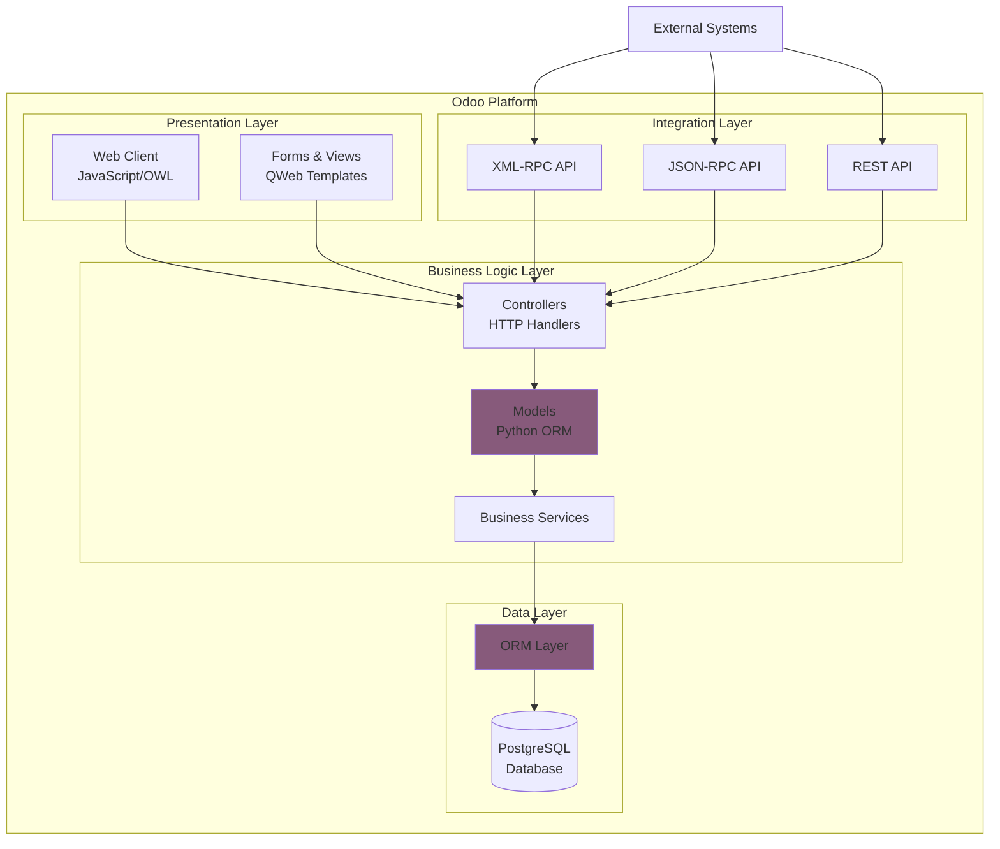
```mermaid
graph TB
    subgraph "Odoo Platform"
        subgraph "Presentation Layer"
            Web[Web Client<br/>JavaScript/OWL]
            Forms[Forms & Views<br/>QWeb Templates]
        end
        
        subgraph "Business Logic Layer"
            Models[Models<br/>Python ORM]
            Controllers[Controllers<br/>HTTP Handlers]
            Services[Business Services]
        end
        
        subgraph "Data Layer"
            ORM[ORM Layer]
            PG[(PostgreSQL<br/>Database)]
        end
        
        subgraph "Integration Layer"
            XMLRPC[XML-RPC API]
            JSONRPC[JSON-RPC API]
            RestAPI[REST API]
        end
    end
    
    Web --> Controllers
    Forms --> Controllers
    Controllers --> Models
    Models --> Services
    Services --> ORM
    ORM --> PG
    
    External[External Systems] --> XMLRPC
    External --> JSONRPC
    External --> RestAPI
    
    XMLRPC --> Controllers
    JSONRPC --> Controllers
    RestAPI --> Controllers
    
    style Models fill:#875a7b
    style ORM fill:#875a7b
```

### Camunda-Odoo Integration Architecture

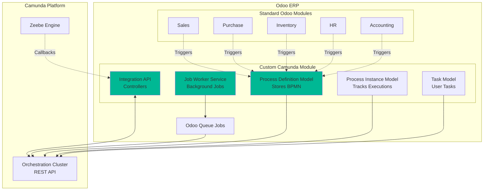
```mermaid
graph TB
    subgraph "Odoo ERP"
        subgraph "Custom Camunda Module"
            ProcessModel[Process Definition Model<br/>Stores BPMN]
            InstanceModel[Process Instance Model<br/>Tracks Executions]
            TaskModel[Task Model<br/>User Tasks]
            JobService[Job Worker Service<br/>Background Jobs]
            API[Integration API<br/>Controllers]
        end
        
        subgraph "Standard Odoo Modules"
            Sales[Sales]
            Purchase[Purchase]
            Inventory[Inventory]
            HR[HR]
            Accounting[Accounting]
        end
        
        Queue[Odoo Queue Jobs]
    end
    
    subgraph "Camunda Platform"
        CamundaAPI[Orchestration Cluster<br/>REST API]
        CamundaEngine[Zeebe Engine]
    end
    
    API <--> CamundaAPI
    JobService --> Queue
    Queue --> CamundaAPI
    
    ProcessModel --> CamundaAPI
    InstanceModel --> CamundaAPI
    TaskModel --> CamundaAPI
    
    Sales -.Triggers.-> ProcessModel
    Purchase -.Triggers.-> ProcessModel
    Inventory -.Triggers.-> ProcessModel
    HR -.Triggers.-> ProcessModel
    Accounting -.Triggers.-> ProcessModel
    
    CamundaEngine -.Callbacks.-> API
    
    style ProcessModel fill:#00b894
    style API fill:#00b894
    style JobService fill:#00b894
```

### Module Structure

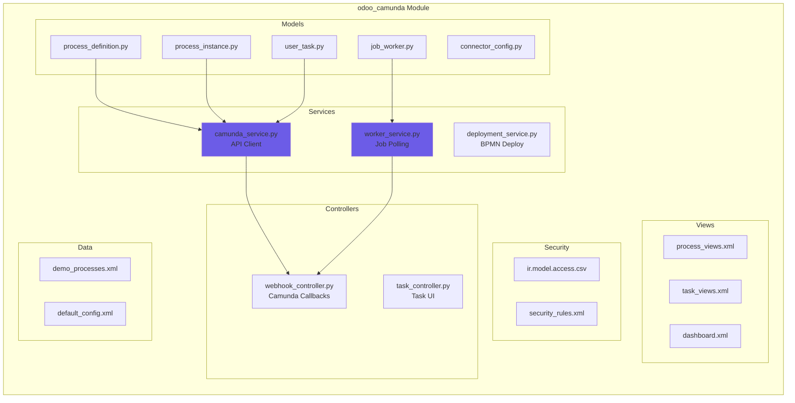
```mermaid
graph LR
    subgraph "odoo_camunda Module"
        subgraph "Models"
            ProcDef[process_definition.py]
            ProcInst[process_instance.py]
            UserTask[user_task.py]
            JobWorker[job_worker.py]
            Connector[connector_config.py]
        end
        
        subgraph "Services"
            CamundaSvc[camunda_service.py<br/>API Client]
            WorkerSvc[worker_service.py<br/>Job Polling]
            DeploySvc[deployment_service.py<br/>BPMN Deploy]
        end
        
        subgraph "Controllers"
            WebHook[webhook_controller.py<br/>Camunda Callbacks]
            TaskCtrl[task_controller.py<br/>Task UI]
        end
        
        subgraph "Views"
            ProcView[process_views.xml]
            TaskView[task_views.xml]
            Dashboard[dashboard.xml]
        end
        
        subgraph "Security"
            Access[ir.model.access.csv]
            Rules[security_rules.xml]
        end
        
        subgraph "Data"
            Demo[demo_processes.xml]
            Config[default_config.xml]
        end
    end
    
    ProcDef --> CamundaSvc
    ProcInst --> CamundaSvc
    UserTask --> CamundaSvc
    JobWorker --> WorkerSvc
    
    CamundaSvc --> WebHook
    WorkerSvc --> WebHook
    
    style CamundaSvc fill:#6c5ce7
    style WorkerSvc fill:#6c5ce7
```

---

## Integration Strategy

### Design Pattern: Bridge Pattern

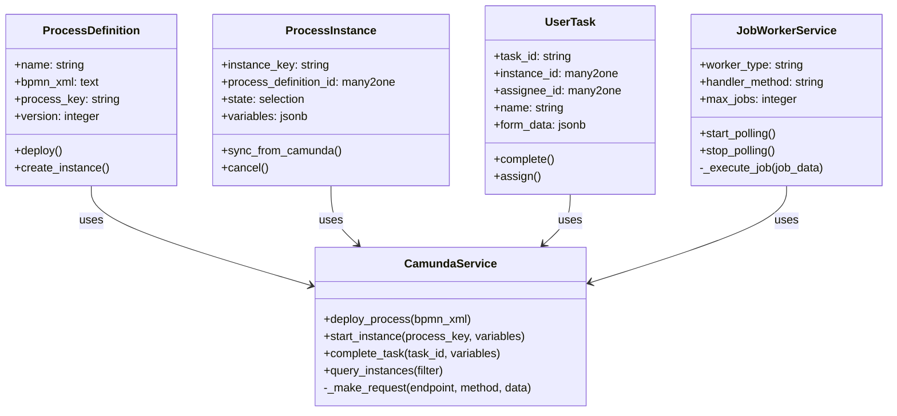
```mermaid
classDiagram
    class CamundaService {
        +deploy_process(bpmn_xml)
        +start_instance(process_key, variables)
        +complete_task(task_id, variables)
        +query_instances(filter)
        -_make_request(endpoint, method, data)
    }
    
    class ProcessDefinition {
        +name: string
        +bpmn_xml: text
        +process_key: string
        +version: integer
        +deploy()
        +create_instance()
    }
    
    class ProcessInstance {
        +instance_key: string
        +process_definition_id: many2one
        +state: selection
        +variables: jsonb
        +sync_from_camunda()
        +cancel()
    }
    
    class UserTask {
        +task_id: string
        +instance_id: many2one
        +assignee_id: many2one
        +name: string
        +form_data: jsonb
        +complete()
        +assign()
    }
    
    class JobWorkerService {
        +worker_type: string
        +handler_method: string
        +max_jobs: integer
        +start_polling()
        +stop_polling()
        -_execute_job(job_data)
    }
    
    ProcessDefinition --> CamundaService : uses
    ProcessInstance --> CamundaService : uses
    UserTask --> CamundaService : uses
    JobWorkerService --> CamundaService : uses
```

### Integration Flow: Order Processing Example

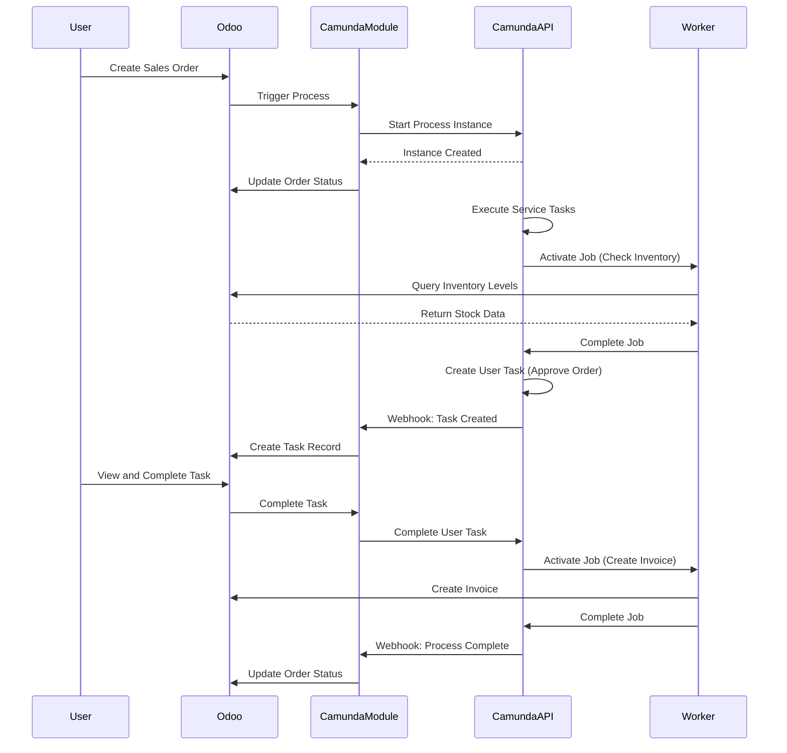
```mermaid
sequenceDiagram
    participant User
    participant Odoo
    participant CamundaModule
    participant CamundaAPI
    participant Worker
    
    User->>Odoo: Create Sales Order
    Odoo->>CamundaModule: Trigger Process
    CamundaModule->>CamundaAPI: Start Process Instance
    CamundaAPI-->>CamundaModule: Instance Created
    CamundaModule->>Odoo: Update Order Status
    
    CamundaAPI->>CamundaAPI: Execute Service Tasks
    CamundaAPI->>Worker: Activate Job (Check Inventory)
    Worker->>Odoo: Query Inventory Levels
    Odoo-->>Worker: Return Stock Data
    Worker->>CamundaAPI: Complete Job
    
    CamundaAPI->>CamundaAPI: Create User Task (Approve Order)
    CamundaAPI->>CamundaModule: Webhook: Task Created
    CamundaModule->>Odoo: Create Task Record
    
    User->>Odoo: View and Complete Task
    Odoo->>CamundaModule: Complete Task
    CamundaModule->>CamundaAPI: Complete User Task
    
    CamundaAPI->>Worker: Activate Job (Create Invoice)
    Worker->>Odoo: Create Invoice
    Worker->>CamundaAPI: Complete Job
    
    CamundaAPI->>CamundaModule: Webhook: Process Complete
    CamundaModule->>Odoo: Update Order Status
```

### Data Synchronization Strategy

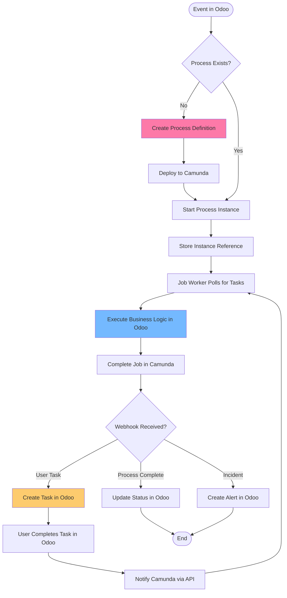
```mermaid
flowchart TD
    Start([Event in Odoo]) --> CheckProcess{Process Exists?}
    
    CheckProcess -->|No| CreateProcess[Create Process Definition]
    CreateProcess --> DeployBPMN[Deploy to Camunda]
    DeployBPMN --> StartInstance
    
    CheckProcess -->|Yes| StartInstance[Start Process Instance]
    StartInstance --> StoreLocal[Store Instance Reference]
    
    StoreLocal --> PollTasks[Job Worker Polls for Tasks]
    PollTasks --> ExecuteTask[Execute Business Logic in Odoo]
    ExecuteTask --> CompleteJob[Complete Job in Camunda]
    
    CompleteJob --> ReceiveWebhook{Webhook Received?}
    ReceiveWebhook -->|User Task| CreateTaskRecord[Create Task in Odoo]
    ReceiveWebhook -->|Process Complete| UpdateStatus[Update Status in Odoo]
    ReceiveWebhook -->|Incident| CreateAlert[Create Alert in Odoo]
    
    CreateTaskRecord --> UserAction[User Completes Task in Odoo]
    UserAction --> NotifyCamunda[Notify Camunda via API]
    NotifyCamunda --> PollTasks
    
    UpdateStatus --> End([End])
    CreateAlert --> End
    
    style CreateProcess fill:#fd79a8
    style ExecuteTask fill:#74b9ff
    style CreateTaskRecord fill:#fdcb6e
```

---

## Odoo Module Implementation Considerations

### 1. Architecture Decisions

#### **Deployment Model**

**Option A: Camunda as Separate Service**
- ✅ Clear separation of concerns
- ✅ Independent scaling
- ✅ Full Camunda feature access
- ❌ Additional infrastructure complexity
- ❌ Network latency between systems

**Option B: Embedded Integration (Not Recommended)**
- ❌ Camunda not designed for embedding
- ❌ Complex maintenance
- ✅ No separate deployment

**Recommendation**: Deploy Camunda as a separate service (Option A)

#### **Communication Pattern**

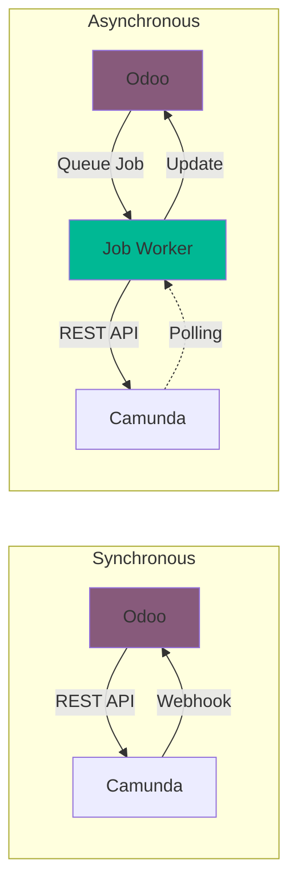
```mermaid
graph LR
    subgraph "Synchronous"
        OdooSync[Odoo] -->|REST API| CamundaSync[Camunda]
        CamundaSync -->|Webhook| OdooSync
    end
    
    subgraph "Asynchronous"
        OdooAsync[Odoo] -->|Queue Job| Worker[Job Worker]
        Worker -->|REST API| CamundaAsync[Camunda]
        CamundaAsync -.Polling.-> Worker
        Worker -->|Update| OdooAsync
    end
    
    style OdooSync fill:#875a7b
    style OdooAsync fill:#875a7b
    style Worker fill:#00b894
```

**Recommendations**:
- Use **synchronous REST** for process deployment, instance creation
- Use **asynchronous job workers** for long-running tasks
- Implement **webhooks** for Camunda-to-Odoo notifications

### 2. Data Model Design

#### Core Models

```python
# Simplified model structure for Odoo

class CamundaProcessDefinition(models.Model):
    _name = 'camunda.process.definition'
    _description = 'Camunda Process Definition'
    
    name = fields.Char(required=True)
    process_key = fields.Char(readonly=True)
    bpmn_xml = fields.Text(required=True)
    version = fields.Integer(default=1)
    deployed = fields.Boolean(default=False)
    camunda_deployment_id = fields.Char()
    
class CamundaProcessInstance(models.Model):
    _name = 'camunda.process.instance'
    _description = 'Camunda Process Instance'
    
    instance_key = fields.Char(readonly=True, index=True)
    process_definition_id = fields.Many2one('camunda.process.definition')
    state = fields.Selection([
        ('active', 'Active'),
        ('completed', 'Completed'),
        ('terminated', 'Terminated'),
        ('incident', 'Incident')
    ])
    variables = fields.Json()
    business_object = fields.Reference(selection=[...])
    
class CamundaUserTask(models.Model):
    _name = 'camunda.user.task'
    _description = 'Camunda User Task'
    
    task_key = fields.Char(readonly=True, index=True)
    instance_id = fields.Many2one('camunda.process.instance')
    name = fields.Char()
    assignee_id = fields.Many2one('res.users')
    form_data = fields.Json()
    state = fields.Selection([
        ('created', 'Created'),
        ('assigned', 'Assigned'),
        ('completed', 'Completed')
    ])
```

### 3. Job Worker Implementation

#### Worker Service Architecture

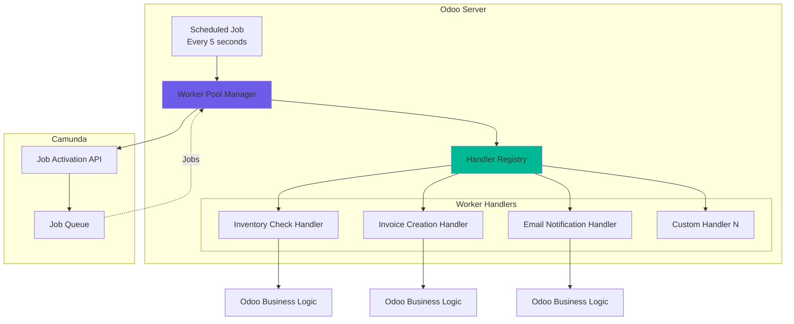
```mermaid
graph TB
    subgraph "Odoo Server"
        CronJob[Scheduled Job<br/>Every 5 seconds]
        WorkerPool[Worker Pool Manager]
        
        subgraph "Worker Handlers"
            Handler1[Inventory Check Handler]
            Handler2[Invoice Creation Handler]
            Handler3[Email Notification Handler]
            HandlerN[Custom Handler N]
        end
        
        Registry[Handler Registry]
    end
    
    subgraph "Camunda"
        JobAPI[Job Activation API]
        Queue[Job Queue]
    end
    
    CronJob --> WorkerPool
    WorkerPool --> JobAPI
    JobAPI --> Queue
    Queue -.Jobs.-> WorkerPool
    
    WorkerPool --> Registry
    Registry --> Handler1
    Registry --> Handler2
    Registry --> Handler3
    Registry --> HandlerN
    
    Handler1 --> OdooAPI1[Odoo Business Logic]
    Handler2 --> OdooAPI2[Odoo Business Logic]
    Handler3 --> OdooAPI3[Odoo Business Logic]
    
    style WorkerPool fill:#6c5ce7
    style Registry fill:#00b894
```

**Implementation Considerations**:
- Use Odoo's cron jobs for worker polling
- Implement handler registry pattern for job types
- Handle errors with retries and incident creation
- Use Odoo queue_job module for async processing
- Implement proper transaction management

### 4. Security and Authentication

```mermaid
graph TB
    subgraph "Authentication Flow"
        OdooUser[Odoo User Login] --> OdooAuth[Odoo Session]
        OdooAuth --> ServiceAccount[Service Account]
        ServiceAccount --> OAuth[OAuth 2.0 Token]
        OAuth --> CamundaReq[Camunda API Request]
    end
    
    subgraph "Authorization"
        CamundaReq --> RBAC[Role-Based Access]
        RBAC --> OdooRole[Map to Odoo Roles]
        OdooRole --> Permission[Grant/Deny Access]
    end
    
    style ServiceAccount fill:#e74c3c
    style RBAC fill:#e74c3c
```

**Security Recommendations**:
- Store Camunda credentials in Odoo's `ir.config_parameter` (encrypted)
- Use OAuth 2.0 for API authentication
- Implement service account for background jobs
- Map Camunda roles to Odoo security groups
- Use HTTPS for all communications
- Implement webhook signature verification

### 5. Process Modeling Integration

#### BPMN Designer Options

**Option A: External Camunda Modeler**
- Use Camunda Web Modeler or Desktop Modeler
- Upload BPMN XML to Odoo
- ✅ Full BPMN 2.0 support
- ✅ Professional modeling tools
- ❌ Context switching

**Option B: Embedded Viewer (Recommended)**
- Use bpmn-js library for viewing
- Edit in external modeler
- ✅ View processes in Odoo
- ✅ Good UX
- ✅ Easy implementation

**Option C: Custom Modeler**
- Build custom BPMN editor in Odoo
- ❌ High development effort
- ❌ Maintenance burden

### 6. Module Dependencies

```yaml
depends:
  - base                    # Core Odoo
  - web                     # Web interface
  - mail                    # Activity tracking
  - queue_job              # Async job processing (OCA)
  
external_libraries:
  - requests               # HTTP client
  - pyjwt                  # JWT token handling
  - python-dateutil        # Date handling
```

### 7. Configuration Management

```python
# Configuration structure in Odoo

class CamundaConfig(models.TransientModel):
    _name = 'camunda.config.settings'
    _inherit = 'res.config.settings'
    
    camunda_url = fields.Char(
        string='Camunda API URL',
        config_parameter='camunda.api_url'
    )
    camunda_client_id = fields.Char(
        string='Client ID',
        config_parameter='camunda.client_id'
    )
    camunda_client_secret = fields.Char(
        string='Client Secret',
        config_parameter='camunda.client_secret'
    )
    worker_poll_interval = fields.Integer(
        default=5,
        config_parameter='camunda.worker_poll_interval'
    )
    max_concurrent_jobs = fields.Integer(
        default=10,
        config_parameter='camunda.max_concurrent_jobs'
    )
```

### 8. Error Handling and Monitoring

```mermaid
flowchart TD
    Error[Error Occurs] --> Classify{Error Type?}
    
    Classify -->|Network Error| Retry[Retry with Backoff]
    Classify -->|Business Error| BusinessIncident[Create Business Incident]
    Classify -->|System Error| SystemIncident[Create System Incident]
    
    Retry --> RetrySuccess{Retry Success?}
    RetrySuccess -->|Yes| Log[Log Success]
    RetrySuccess -->|No| MaxRetries{Max Retries?}
    
    MaxRetries -->|Yes| CreateIncident[Create Camunda Incident]
    MaxRetries -->|No| Retry
    
    BusinessIncident --> NotifyUser[Notify User in Odoo]
    SystemIncident --> NotifyAdmin[Notify Admin]
    CreateIncident --> NotifyUser
    
    Log --> End([End])
    NotifyUser --> End
    NotifyAdmin --> End
    
    style Error fill:#e74c3c
    style CreateIncident fill:#e74c3c
```

**Monitoring Recommendations**:
- Log all API calls to Odoo logging system
- Create dashboard for process instance status
- Implement alerts for failed jobs
- Track performance metrics (API latency, job duration)
- Use Odoo's mail.activity for notifications

---

## Integration Strategy

### Phase 1: Foundation (Weeks 1-2)

1. **Setup Camunda Instance**
   - Deploy Camunda 8.8 (Docker or Kubernetes)
   - Configure PostgreSQL and Elasticsearch
   - Setup authentication (OAuth2)
   - Verify installation with test process

2. **Create Odoo Module Skeleton**
   - Initialize module structure
   - Setup dependencies
   - Create base configuration models
   - Implement API client service

3. **Basic Connectivity**
   - Implement authentication
   - Create health check endpoint
   - Test API connectivity
   - Setup error logging

### Phase 2: Core Integration (Weeks 3-4)

1. **Process Management**
   - Implement process definition model
   - Create deployment service
   - Build process instance tracking
   - Add basic UI views

2. **Job Worker Framework**
   - Implement worker polling mechanism
   - Create handler registry
   - Build retry and error handling
   - Add transaction management

3. **User Task Integration**
   - Create task model
   - Implement task completion flow
   - Build task assignment logic
   - Create task UI in Odoo

### Phase 3: Business Logic (Weeks 5-6)

1. **Business Process Integration**
   - Identify pilot processes (e.g., Order-to-Cash)
   - Model processes in BPMN
   - Implement job handlers
   - Create workflow triggers

2. **Data Synchronization**
   - Implement webhook receivers
   - Build state synchronization
   - Add variable mapping
   - Create audit trails

### Phase 4: Production Readiness (Weeks 7-8)

1. **Security Hardening**
   - Implement comprehensive authentication
   - Add authorization checks
   - Secure webhook endpoints
   - Encrypt sensitive data

2. **Monitoring & Observability**
   - Create monitoring dashboard
   - Implement alerting
   - Add performance tracking
   - Setup logging and audit

3. **Documentation & Testing**
   - Write user documentation
   - Create developer guide
   - Build test suite
   - Perform load testing

### Deployment Checklist

```yaml
Infrastructure:
  ☐ Camunda cluster deployed and configured
  ☐ PostgreSQL backup strategy
  ☐ Elasticsearch cluster healthy
  ☐ Network connectivity tested
  ☐ SSL certificates configured

Odoo Module:
  ☐ Module installed in target environment
  ☐ Dependencies resolved
  ☐ Configuration parameters set
  ☐ Service account created
  ☐ Cron jobs activated

Security:
  ☐ OAuth2 credentials configured
  ☐ API access restricted
  ☐ Webhook signatures verified
  ☐ Data encryption enabled
  ☐ Security audit completed

Testing:
  ☐ Unit tests passing
  ☐ Integration tests passing
  ☐ End-to-end tests passing
  ☐ Performance benchmarks met
  ☐ Error scenarios tested

Documentation:
  ☐ Installation guide
  ☐ Configuration guide
  ☐ User manual
  ☐ API documentation
  ☐ Troubleshooting guide
```

---

## Recommendations

### Technical Recommendations

1. **Use Camunda 8.8+ for New Implementations**
   - Benefit from unified architecture
   - Simpler deployment and management
   - Single REST API
   - Better performance

2. **Implement Proper Abstraction Layer**
   - Don't couple Odoo business logic to Camunda API
   - Use service pattern for API interactions
   - Make Camunda swappable if needed

3. **Leverage Odoo's Strengths**
   - Use Odoo's ORM for data persistence
   - Leverage Odoo's security framework
   - Utilize Odoo's UI components
   - Take advantage of Odoo's multi-company features

4. **Design for Resilience**
   - Implement retry mechanisms with exponential backoff
   - Handle network failures gracefully
   - Use idempotent operations
   - Store process state locally for recovery

5. **Monitor and Observe**
   - Track all process instances
   - Monitor job execution times
   - Alert on incidents
   - Dashboard for process health

### Architectural Patterns

#### Event-Driven Integration

```mermaid
sequenceDiagram
    participant Odoo
    participant EventBus
    participant Worker
    participant Camunda
    
    Odoo->>EventBus: Publish: Order Created
    EventBus->>Worker: Consume Event
    Worker->>Camunda: Start Process Instance
    Camunda-->>Worker: Instance Created
    Worker->>EventBus: Publish: Process Started
    EventBus->>Odoo: Update Order
```

#### Saga Pattern for Distributed Transactions

```mermaid
graph LR
    subgraph "Order Process Saga"
        Start[Start Order] --> Reserve[Reserve Inventory]
        Reserve --> |Success| Payment[Process Payment]
        Reserve --> |Failure| CancelOrder[Cancel Order]
        
        Payment --> |Success| Ship[Ship Order]
        Payment --> |Failure| ReleaseInv[Release Inventory]
        
        Ship --> Complete[Complete Order]
        
        ReleaseInv --> CancelOrder
    end
    
    style CancelOrder fill:#e74c3c
    style Complete fill:#00b894
```

### Best Practices

1. **Process Design**
   - Keep processes focused and modular
   - Use sub-processes for reusability
   - Design for failure scenarios
   - Version your processes

2. **Data Management**
   - Minimize process variables
   - Use references to Odoo records
   - Don't store large payloads in Camunda
   - Implement data retention policies

3. **Performance**
   - Use job worker batching
   - Implement caching where appropriate
   - Optimize database queries
   - Monitor and tune performance

4. **Testing**
   - Test processes in isolation
   - Mock external dependencies
   - Test failure scenarios
   - Perform load testing

5. **Governance**
   - Establish process ownership
   - Version control BPMN files
   - Document processes
   - Regular process reviews

---

## Conclusion

Integrating Camunda with Odoo creates a powerful combination of process orchestration and ERP capabilities. The unified architecture of Camunda 8.8+ significantly simplifies deployment and management, making it an excellent choice for organizations looking to add sophisticated workflow capabilities to their Odoo implementation.

Key takeaways:

1. **Modern Architecture**: Camunda 8.8+ offers a streamlined, production-ready platform
2. **Flexible Integration**: Multiple integration patterns available (REST, workers, webhooks)
3. **Odoo-Native Implementation**: Leverage Odoo's framework for seamless UX
4. **Scalable Design**: Both platforms designed for horizontal scalability
5. **Composable Approach**: Build modular, maintainable process automation

### Next Steps

1. Evaluate business processes for automation candidates
2. Set up proof-of-concept environment
3. Model first pilot process in BPMN
4. Develop Odoo module following guidelines above
5. Iterate and expand to additional processes

### Resources

- **Camunda Documentation**: https://docs.camunda.io/
- **Camunda REST API**: https://docs.camunda.io/docs/apis-tools/camunda-api-rest/
- **Odoo Development**: https://www.odoo.com/documentation/
- **BPMN 2.0 Specification**: https://www.omg.org/spec/BPMN/2.0/
- **Camunda Community**: https://forum.camunda.io/
- **Odoo Community**: https://www.odoo.com/forum/

---

*Document Version: 1.0*  
*Last Updated: October 2025*  
*Based on: Camunda 8.8 Architecture & Odoo 17/18 Framework*